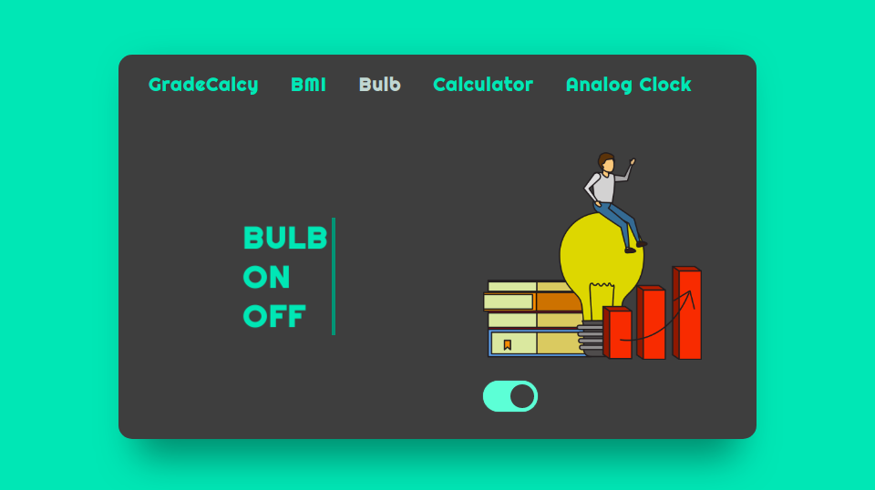

# FiveInOne-JavaScript
This Project is a pack of 5 mini JavaScript Projects.

## 1 . Grade Calculator
This simply take inputs marks of 4 Subjects from users and calculate the total sum , percentage and Grade and then Simply display on the Screen. 

## 2 . BMI Calculator
It takes inputs as Name, Height (in feets) and Weight(in Kg) of the user. Then it calculates the BMI Index of the user and tells about his wieght. 

## 3 . Bulb ON OFF
javascript Function is used to changing image in the action of Toggle Button . 

## 4 . Calculator
This is a Simple Calculator App. 

## 5 . Analog Clock
Analog Clock uses time() to fetch the exact time and Using Transform class in Css it rotates the niddle of clock. 

